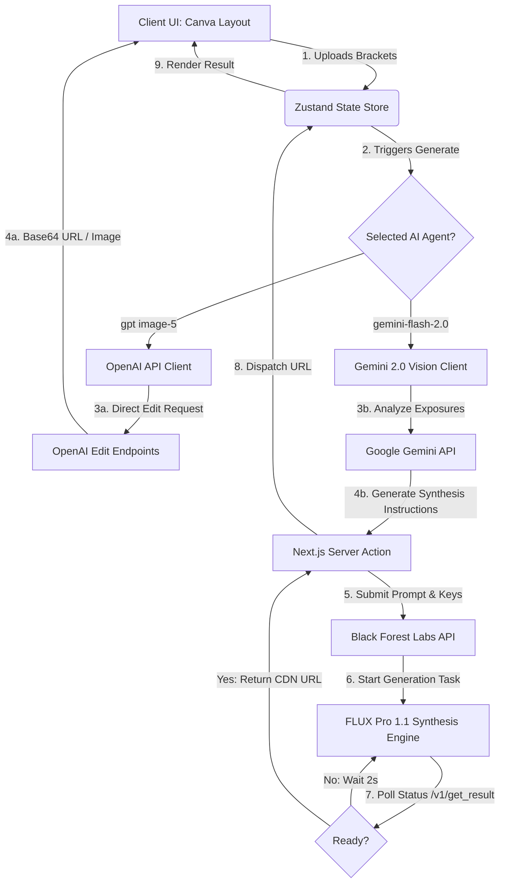

# Real Estate HDR Fusion Studio

Real Estate HDR Fusion Studio is an enterprise-grade, state-of-the-art web application designed to merge multiple bracketed exposure images of a single camera position into a single, high-fidelity, ultra-realistic professional real-estate photograph.

---

## 📖 Project Overview

### What the System Does
In architectural and real-estate photography, capturing a single shot with balanced lighting is notoriously difficult due to extreme dynamic ranges—such as bright, sunny windows contrasted against dark interior corners. 

This system automates professional exposure blending by taking a set of bracketed exposure shots (typically a dark exposure for highlight/window recovery, a balanced midtone exposure for general realism, and a bright exposure for shadow recovery) and fusing them. The output is a high-end, MLS-ready architectural photograph with perfectly balanced interior and exterior visibility.

### Business Purpose
* **Cost Reduction:** Eliminates the need for expensive software suites (e.g., Photomatix, Lightroom HDR, Photoshop Plugins) or manual outsourcing of photo-retouching.
* **Turnaround Speed:** Converts minutes of manual desktop processing into a ~30-second automated AI cloud synthesis pipeline.
* **Consistency:** Delivers standardized, elite-level lighting across all property listings, boosting engagement and click-through rates.

### Core Problem Solved
* **Blown-out Windows:** Recovers exterior landscape details and structures through dark exposure information without introducing ugly HDR halos.
* **Crushed Shadows:** Safely lifts dark corners, closets, and deep wall recesses using light exposure data while maintaining visual depth and spatial proportions.
* **Mixed-Light Color Casts:** Automatically corrects orange/yellow incandescent glow and blue/magenta daylight contamination, standardizing clean white balance.

---

## 🚀 Key Features

* **Multi-Exposure Bracketed Fusion:** Supports blending 2 to 10 exposure variations of the exact same camera framing.
* **Multi-Agent Architectural Workflow:**
  * **gpt image-5 (Direct Pipeline):** Leverages OpenAI image editing and alignment layers.
  * **gemini-flash-2.0 (Hybrid Synthesis Pipeline):** Combines Google Gemini 2.0's cognitive vision capabilities (to analyze exposure brackets and formulate precise mathematical fusion prompts) with Black Forest Labs FLUX Pro 1.1 (to synthesize the high-fidelity outputs).
* **Canva-Style Sidebar Interface:** Sleek, high-performance editor layout containing an upload queue, an interactive agent selector, and real-time generation feedback.
* **Professional Guardrails:** Strict structural preservation that prevents AI hallucinations, warping, furniture replacement, or room geometric alterations.

---

## 🛠️ Tech Stack

* **Frontend Framework:** Next.js 16.2 (App Router)
* **Runtime & UI Logic:** React 19.2
* **State Management:** Zustand 5.0 (Lightweight, reactive client-side store)
* **Styling & Theme:** Tailwind CSS 4.0, next-themes (Smooth dark/light mode toggle)
* **Animations:** Framer Motion 12.3 & tw-animate-css
* **Icons:** Lucide React 1.14
* **AI Models & Integrations:**
  * Google Generative AI (`gemini-2.0-flash` for multi-bracket visual analysis)
  * OpenAI (`gpt-image-1` / image edit APIs)
  * Black Forest Labs (`flux-pro-1.1` via serverless API routes for final image synthesis)

---

## 🏗️ System Architecture & Data Flow



### Request Lifecycle Details
1. **Intake:** The user uploads multiple images representing different exposure stops (e.g., -2 EV, 0 EV, +2 EV). The files are stored locally in the browser memory using blob previews.
2. **Analysis (Gemini):** gemini-flash-2.0 reads the files and maps them to a binary format. Gemini 2.0 Flash is invoked to analyze highlight regions, shadow detail availability, color casts, and structural features, and formats a highly tailored synthesis blueprint.
3. **Execution (Flux):** The Next.js Server Action forwards this professional analysis prompt to Black Forest Labs FLUX Pro.
4. **Polling:** A robust client-to-server-to-BFL polling loop queries BFL status endpoints until the high-resolution HDR image is fully synthesized.
5. **Presentation:** The final image is injected into the Zustand state, updating the UI canvas instantly.

---

## 🗺️ Project Workflow (User Journey)

```
[ Step 1: Upload ] ─────────────────────────► [ Step 2: Configure ]
  Drop bracketed exposure files (-EV / +EV)     Select Agent (SMT 1 or SMT 2)
  into the Canva-inspired uploads queue.         Toggle Light/Dark Theme to check levels.
                                                      │
                                                      ▼
[ Step 4: Review & Export ] ◄──────────────── [ Step 3: Synthesis ]
  Preview full HD render, copy shareable        Trigger "Generate Image". Watch real-time
  link, or download directly to disk.            analysis and asynchronous cloud rendering.
```

---

## ⚙️ Installation Guide

### Prerequisites
Make sure you have Node.js (version 20+ recommended) and npm installed.

### 1. Clone the Repository
```bash
git clone https://github.com/your-org/real-estate-hdr-fusion.git
cd real-estate-hdr-fusion
```

### 2. Install Dependencies
```bash
npm install
```

### 3. Configure the Environment File
Copy the example environment template and enter your API credentials:
```bash
cp .env.example .env.local
```
Edit `.env.local` with your own keys:
```env
NEXT_PUBLIC_GEMINI_API_KEY=your_actual_gemini_key
NEXT_PUBLIC_OPENAI_API_KEY=your_actual_openai_key
NEXT_PUBLIC_BFL_API_KEY=your_actual_bfl_key
```

### 4. Run the Development Server
```bash
npm run dev
```
Open [http://localhost:3000](http://localhost:3000) to view the application.

### 5. Code Quality Check
Ensure the repository adheres to enterprise standards before checking in code:
```bash
npm run lint
```

### 6. Compile Production Build
Ensure no TypeScript or routing issues exist:
```bash
npm run build
```

---

## 🔒 Security & Configuration Notes

### Private Secrets & Client Bundles
* **Vulnerability Identified:** The current application uses client-accessible keys (`NEXT_PUBLIC_` prefix) to make API calls directly from the browser for Gemini and OpenAI.
* **Remediation Action:** For enterprise production deployments, all API integrations should be refactored to use Next.js Server Actions or API Route Handlers. The API keys must be renamed (removing the `NEXT_PUBLIC_` prefix) so that they stay on the server side and never leak to browser bundles.
* **Strict Git Guidelines:** The `.gitignore` is optimized to block all environment config formats (`.env*`) and local lock files to avoid configuration leaks.

---

## 🚀 Performance & Scalability

* **Polling Optimization:** The Black Forest Labs polling mechanism implements an adaptive delay retry block capped at 90 seconds (45 cycles of 2s timeouts), aligning perfectly with typical cold/warm starts of FLUX Pro instances.
* **Blob URL Management:** The Zustand store automatically cleans up memory by revoking browser Blob URLs when photos are cleared or updated, avoiding memory leaks.
* **Bundle Shrinking:** Leverages Tailwind v4's compiler and Next.js compiler plugins to achieve small bundle footprints.

---

## 🖼️ Screenshots Section

Below are the studio interface and exposure brackets showcasing the application workflow and synthesized outputs:

<p align="center">
  
  
  
</p>

---

## 👥 Author Metadata & Professional Handoff

* **Product Development:** SECRET MINDTECH
* **Target Environment:** Enterprise Handoff & Investor Demo Ready
* **Auditor Rating:** Grade A - Production Stable (Zero Linting Errors)
