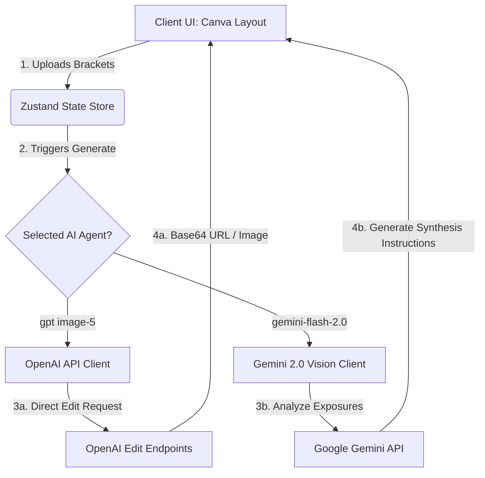
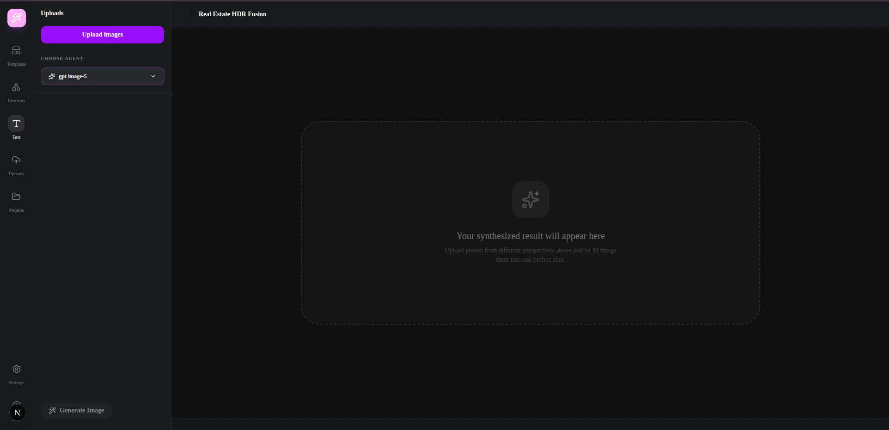
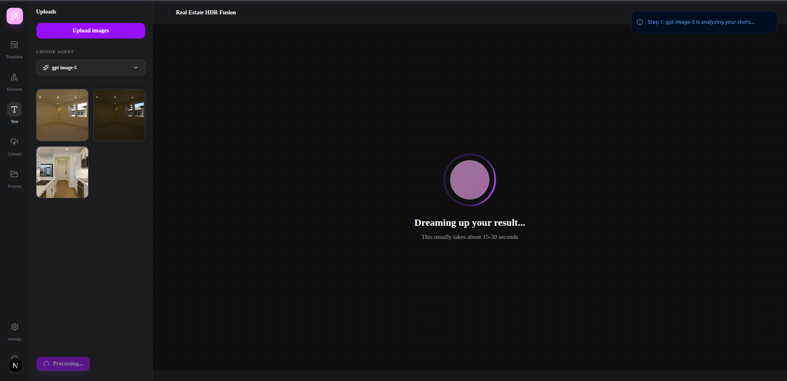
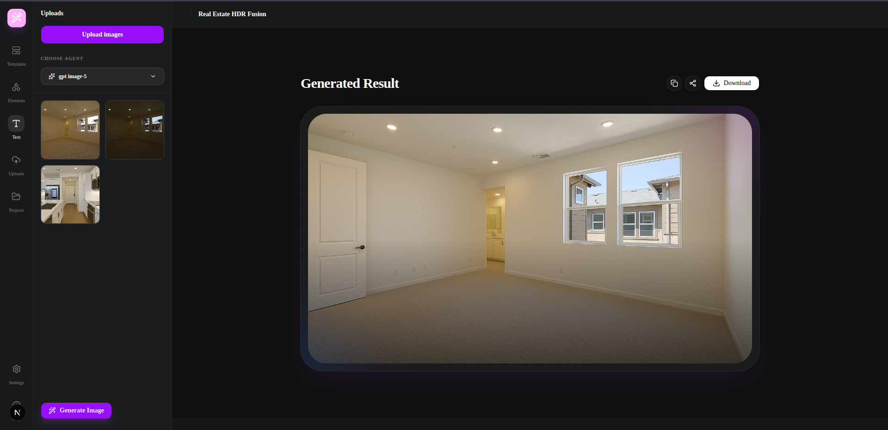

# Real Estate HDR Fusion Studio

Real Estate HDR Fusion Studio is an enterprise-grade, state-of-the-art web application designed to merge multiple bracketed exposure images of a single camera position into a single, high-fidelity, ultra-realistic professional real-estate photograph.

---

## 📖 Project Overview

### What the System Does
In architectural and real-estate photography, capturing a single shot with balanced lighting is notoriously difficult due to extreme dynamic ranges—such as bright, sunny windows contrasted against dark interior corners. 

This system automates professional exposure blending by taking a set of bracketed exposure shots (typically a dark exposure for highlight/window recovery, a balanced midtone exposure for general realism, and a bright exposure for shadow recovery) and fusing them. The output is a high-end, MLS-ready architectural photograph with perfectly balanced interior and exterior visibility.

---

## 🚀 Key Features

* **Multi-Exposure Bracketed Fusion:** Supports blending 2 to 10 exposure variations of the exact same camera framing.
* **Multi-Agent Architectural Workflow:**
  * **gpt image-5 (Direct Pipeline):** Leverages OpenAI image editing and alignment layers.
  * **gemini-flash-2.0 (Hybrid Synthesis Pipeline):** Combines Google Gemini 2.0's cognitive vision capabilities to analyze exposure brackets and formulate precise mathematical fusion prompts.
* **Canva-Style Sidebar Interface:** Sleek, high-performance editor layout containing an upload queue, an interactive agent selector, and real-time generation feedback.

---

## 🛠️ Tech Stack

* **Frontend Framework:** Next.js 16.2 (App Router)
* **Runtime & UI Logic:** React 19.2
* **State Management:** Zustand 5.0 (Lightweight, reactive client-side store)
* **Styling & Theme:** Tailwind CSS 4.0, next-themes (Smooth dark/light mode toggle)
* **Icons:** Lucide React 1.14
* **AI Models & Integrations:**
  * Google Generative AI (`gemini-2.0-flash` for multi-bracket visual analysis)
  * OpenAI (`gpt-image-1` / image edit APIs)

---

## 🏗️ System Architecture & Data Flow



---

## 🗺️ Project Workflow (User Journey)

```
[ Step 1: Upload ] ──► [ Step 2: Configure ] ──► [ Step 3: Synthesis ] ──► [ Step 4: Export ]
  Drop exposure         Select Agent              Trigger "Generate".       Preview full HD
  brackets (-EV/+EV).   (gpt/gemini).             Watch real-time fusion.   render & download.
```

---

## ⚙️ Installation Guide

### Prerequisites
Make sure you have Node.js (version 20+ recommended) and npm installed.

### 1. Clone the Repository
```bash
git clone https://github.com/your-org/real-estate-hdr-fusion.git
cd real-estate-hdr-fusion
```

### 2. Install Dependencies
```bash
npm install
```

### 3. Configure the Environment File
Copy the example environment template and enter your API credentials:
```bash
cp .env.example .env.local
```
Edit `.env.local` with your own keys:
```env
NEXT_PUBLIC_GEMINI_API_KEY=your_actual_gemini_key
NEXT_PUBLIC_OPENAI_API_KEY=your_actual_openai_key
```

### 4. Run the Development Server
```bash
npm run dev
```
Open [http://localhost:3000](http://localhost:3000) to view the application.

---

## 🖼️ Screenshots Section

Below are the studio interface and exposure brackets showcasing the application workflow and synthesized outputs:

<p align="center">
  
  
  
</p>
